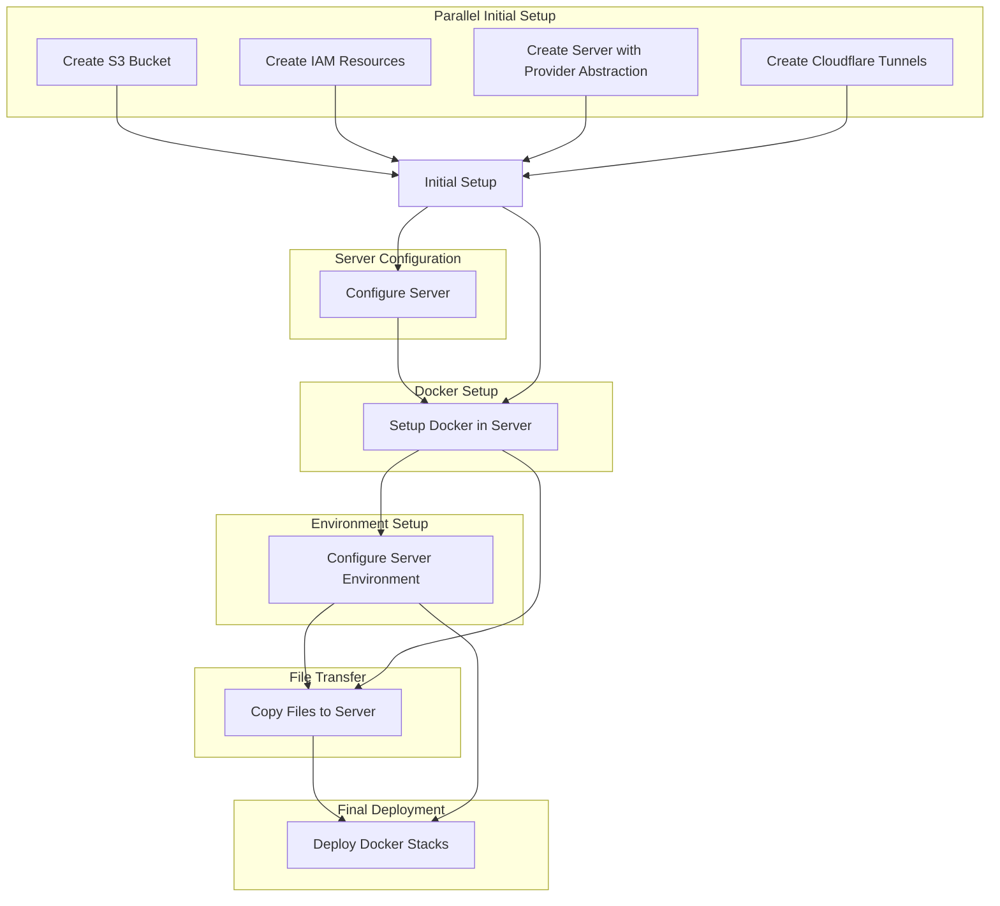

# Mau App Infrastructure

This repository contains the infrastructure-as-code and deployment configuration for Mau's application using Pulumi and GitHub Actions.

## Overview

- **Infrastructure**: AWS (S3, IAM), Hetzner Cloud, and Cloudflare
- **Deployment**: Docker Swarm
- **CI/CD**: GitHub Actions
- **IaC Tool**: Pulumi (TypeScript)

## Key Components

- S3 buckets for application data and tooling
- IAM resources for AWS access management
- Cloud server provisioning with provider abstraction (Hetzner, DigitalOcean)
- Cloudflare Tunnels for secure access
- Docker Swarm setup
- Automated backups to S3
- Reverse proxy and SSL termination (Caddy)
- Monitoring and logging (Dozzle)
- Custom API for updating Docker images [(container-updater)](https://github.com/codigo/container-updater)

## Server Provider Abstraction Overview

The server provider abstraction allows you to seamlessly switch between different cloud providers (e.g., Hetzner, DigitalOcean) for server provisioning using Pulumi. By defining a common interface, `ServerProvider`, and implementing it for each provider, you can inject the desired provider's implementation without changing the rest of your infrastructure code.

### How It Works

1. **Interface Definition:**
   - The `ServerProvider` interface defines a contract for creating servers. Each provider must implement this interface.

2. **Provider Implementations:**
   - **HetznerProvider:** Implements the `ServerProvider` interface to provision servers on Hetzner Cloud.

3. **Usage:**
   - Instantiate the desired provider and pass it to the server creation logic in your Pulumi program.

### Example Usage

```typescript
import { HetznerProvider } from "./infra/hetznerProvider";
import { ServerProvider } from "./infra/serverProvider";

// Instantiate the desired server provider
const serverProvider: ServerProvider = new HetznerProvider();

// Use the provider to create a server
const serverResources = serverProvider.createServer(
  new pulumi.Config().require("appName"),
  new pulumi.Config().requireSecret("sshPublicKey")
);
```

### Benefits

- **Flexibility:** Easily switch between different cloud providers without modifying your infrastructure code.
- **Extensibility:** Add new providers by implementing the `ServerProvider` interface.
- **Maintainability:** Centralized logic for server creation reduces duplication and simplifies maintenance.

## Infrastructure Deployment Flow

Our infrastructure deployment process follows a specific flow to ensure all components are set up correctly:



## Project Structure

- `.github/workflows/`: Contains GitHub Actions workflow files for CI/CD
- `bin/`: Utility scripts for the project
- `infra/`: Pulumi infrastructure-as-code files
  - `serverProvider.ts`: Defines the `ServerProvider` interface
  - `hetznerProvider.ts`: Implements the `ServerProvider` interface for Hetzner
- `mau-app/`: Main application code and configuration
- `tooling/`: Additional tools and utilities for the project
- `docker-compose.mau-app.yaml`: Docker Compose file for the main application
- `docker-compose.tooling.yaml`: Docker Compose file for tooling services
- `index.ts`: Main entry point for Pulumi infrastructure code
- `Pulumi.yaml`: Pulumi project configuration

## Setup and Deployment

1. Fork this repository
2. Set up required secrets in GitHub repository settings
3. Push to main branch or manually trigger the GitHub Actions workflow

The deployment is fully automated and includes:

- Processing configuration files
- Setting up SSH keys
- Configuring Pulumi with required settings and secrets
- Executing the Pulumi deployment

## Key Services

- **Caddy**: Reverse proxy and SSL termination
- **Dozzle**: Docker container log viewer
- **Cloudflared**: Cloudflare tunnel client for secure access
- **container-updater**: Custom service for updating Docker containers

### container-updater

The container-updater is a custom service designed to facilitate automatic updates of Docker containers in the swarm. It exposes an endpoint `/update` that accepts POST requests with the following characteristics:

- **Payload**: Includes the `appName` of the container to be updated
- **Authentication**: Protected by a JWT Secret
- **Functionality**: Uses Docker Swarm commands to update the specified container with a new image
- **Trigger**: Designed to be called by a GitHub Action when a new image is available

To update a container:

1. A GitHub Action builds and pushes a new image
2. The Action then sends a POST request to `https://updater.codigo.sh/update` with the `appName` in the payload
3. The request must include a valid JWT for authentication
4. The container-updater service receives the request and triggers the update in the Docker Swarm

This approach allows for secure, automated updates of specific containers without manual intervention.

## Customization

- Modify Pulumi scripts (`*.ts` files) to change infrastructure
- Update Docker Compose files and configurations in GitHub secrets for application changes

## Maintenance

- Regular updates are handled automatically by the container-updater service
- Monitor logs via Dozzle for any issues during updates

## Security

- Root SSH access is disabled
- Only the `codigo` user can SSH into the server
- Sensitive data stored in GitHub secrets and Pulumi config
- Cloudflare Tunnels provide secure access without exposing ports
- container-updater endpoint is protected by JWT authentication

## Development

To work on this project locally:

1. Ensure you have Node.js and npm installed
2. Install Pulumi CLI
3. Run `npm install` to install dependencies
4. Use `pulumi preview` to check infrastructure changes before applying

For detailed setup instructions and troubleshooting, please refer to the project documentation.

## License

[MIT License](LICENSE)
