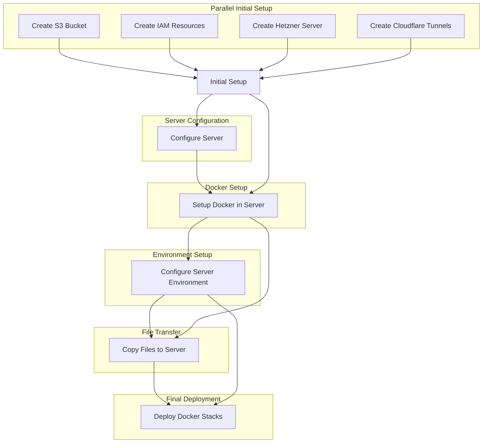

# Mau App Infrastructure

This repository contains the infrastructure-as-code and deployment configuration for Mau's application using Pulumi and GitHub Actions.

## Overview

- **Infrastructure**: AWS (S3, IAM), Hetzner Cloud, and Cloudflare
- **Deployment**: Docker Swarm
- **CI/CD**: GitHub Actions
- **IaC Tool**: Pulumi (TypeScript)

## Key Components

- S3 buckets for application data and tooling
- IAM resources for AWS access management
- Hetzner Cloud server for hosting the application
- Cloudflare Tunnels for secure access
- Docker Swarm setup
- Automated backups to S3
- Reverse proxy and SSL termination (Caddy)
- Monitoring and logging (Dozzle)
- Automatic Docker image updates (TODO as shepherd is not used anymore)

## Infrastructure Deployment Flow

Our infrastructure deployment process follows a specific flow to ensure all components are set up correctly:

## Project Structure

- `.github/workflows/`: Contains GitHub Actions workflow files for CI/CD
- `bin/`: Utility scripts for the project
- `infra/`: Pulumi infrastructure-as-code files
- `mau-app/`: Main application code and configuration
- `tooling/`: Additional tools and utilities for the project
- `docker-compose.mau-app.yaml`: Docker Compose file for the main application
- `docker-compose.tooling.yaml`: Docker Compose file for tooling services
- `index.ts`: Main entry point for Pulumi infrastructure code
- `Pulumi.yaml`: Pulumi project configuration

## Setup and Deployment

1. Fork this repository
2. Set up required secrets in GitHub repository settings
3. Push to main branch or manually trigger the GitHub Actions workflow

The deployment is fully automated and includes:

- Processing configuration files
- Setting up SSH keys
- Configuring Pulumi with required settings and secrets
- Executing the Pulumi deployment

## Key Services

- **Caddy**: Reverse proxy and SSL termination
- **Dozzle**: Docker container log viewer
- **Cloudflared**: Cloudflare tunnel client for secure access

## Customization

- Modify Pulumi scripts (`*.ts` files) to change infrastructure
- Update Docker Compose files and configurations in GitHub secrets for application changes

## Maintenance

- TODO as shepherd is not used anymore

## Security

- Root SSH access is disabled
- Only the `codigo` user can SSH into the server
- Sensitive data stored in GitHub secrets and Pulumi config
- Cloudflare Tunnels provide secure access without exposing ports

## Development

To work on this project locally:

1. Ensure you have Node.js and npm installed
2. Install Pulumi CLI
3. Run `npm install` to install dependencies
4. Use `pulumi preview` to check infrastructure changes before applying

For detailed setup instructions and troubleshooting, please refer to the project documentation.

## License

[MIT License](LICENSE)
